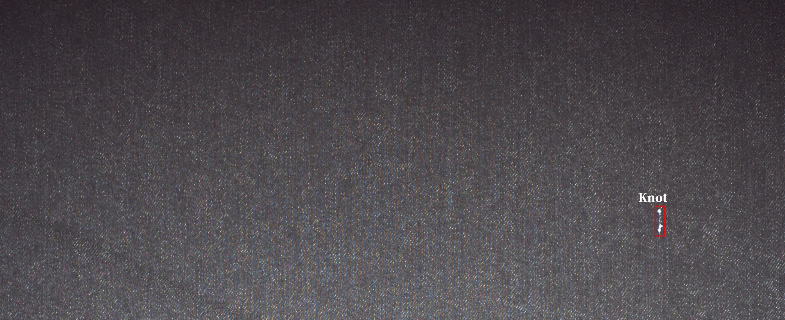
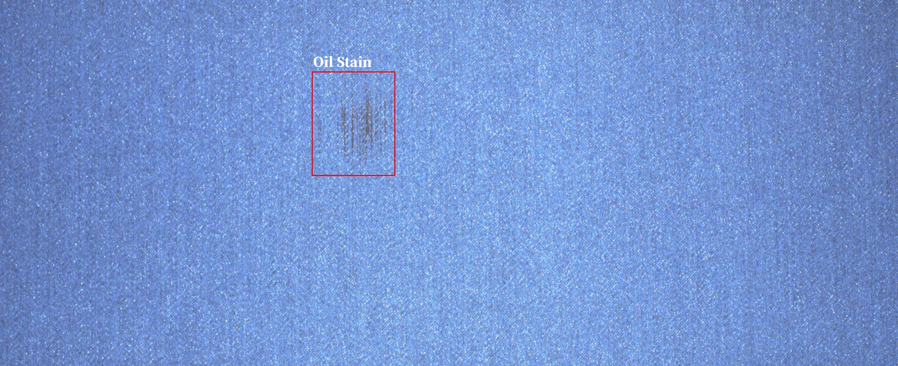
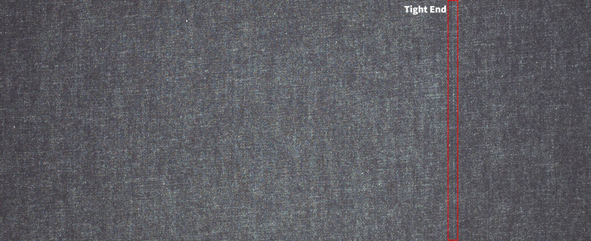
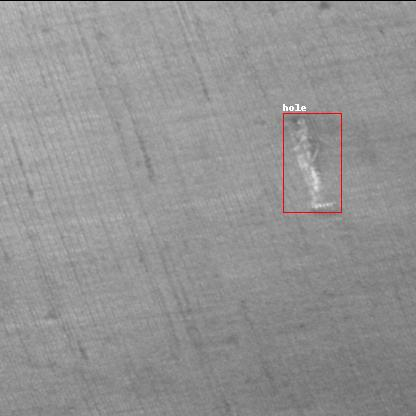
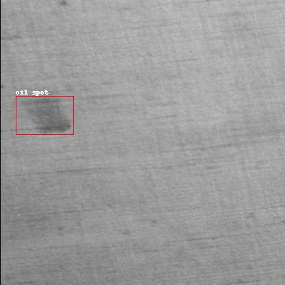
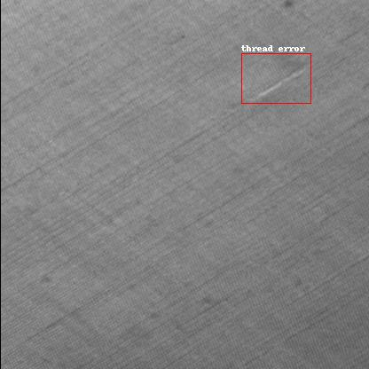
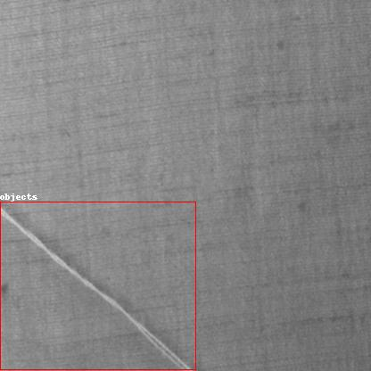

# TIANCHI （Ali cloud Tianchi Textile Defect Detection Dataset）

The platform collects images of cloth on-site at the Nanhai Textile Workshop in Foshan, produces and publishes a large-scale, high-quality cloth defects dataset, and provides fine annotations to meet the algorithmic requirements. The data covers all kinds of important defects of cloth in the textile industry, and each image contains one or more kinds of defects, such as hanging warp, broken spandex, knots and so on. The data includes two categories including plain and fancy coloured cloths.

# Data format

The data for solid coloured fabrics contains a picture of the defects and marking data for the defects. The labelling data shows the exact location of the defects and the type of defects in detail.



a) We will provide image data and recognition labels for training, folder structure:

    TIANCHI

    ----Annotations

        -----anno_train.json

    ----train

    ----test

    ----valid

b) Annotations : stores attribute label annotations.

c) anno_train.json : holds the detailed annotation information of the defects.

d) train : holds the image data for the training set

e) test : holds the image data for the test set.

f) valid : holds the image data for the validation set.

# Type of data set

Manufacture, image recognition

# data set protocol

The dataset is distributed under the CC BY-SA 4.0 license.

<br><br><br>

# TILDA （TILDA Textile Defect Detection Dataset）

TILDA is a textile texture database developed within the framework of the texture analysis working group of the DFG (Deutsche Forschungsgemeinschaft) main research programme ‘Automated Visual Inspection of Technical Objects’. The TILDA Textile Defect Dataset is a dataset designed for the detection of surface defects in textiles and covers four different textile defect categories: ‘hole’, ‘objects’, ‘oil spot’, ‘thread error’. This dataset can be directly used for YOLO series model training without additional preprocessing steps.

# Data format

     Contains defect image data and labelling information  
     Image format: .jpg
     Label format: .txt
     Configuration file: .yaml



a) We will provide image data and recognition labels for training, folder structure:

    TILDA

    ----train

        -----images
        -----labels

    ----test

        -----images

    ----valid

        ----images
        ----labels

    ----data.yaml


a) train : stores the image data for the training set and the annotations.

b) images : the image data

c) labels : store the labelled attributes.

d) test: the images of the test set

e) valid: the image data for the validation set.

f) data.yaml: the configuration file for model training.
# 数据集特点


Highly targeted: specialised in the detection of defects on textile surfaces, suitable for quality control in the textile industry.

High-definition images: Although the number of images in the dataset is relatively small, each image is of high-definition quality, which ensures that the details of the defects are clearly visible.

Standardised annotation: all images have been annotated with .txt tag files, making it easy to use them directly for YOLOv8 model training.

Configuration file: A .yaml file is provided to simplify the process of configuring the dataset, allowing users to quickly set up and start training.

# Data set characteristics

Defect detection: can be used to train machine learning models to recognise multiple defect types on textile surfaces and improve detection accuracy.

Quality control: helps textile companies to detect and deal with surface defects in a timely manner to improve product quality.

Automated detection: Combined with automated equipment, real-time detection of textile surface defects can be realised to improve the efficiency of production lines.

Research and development: As a benchmark data set, support academic research and technology development, and promote the application of target detection technology in textile surface defect detection.

Education and training: as a teaching resource to help students and practitioners understand and master the relevant technologies and methods for textile surface defect detection.
# Sample code

The following is a simple Python script example for loading images and their corresponding labels in a dataset and drawing the labelled bounding boxes:

```python
1import os
2import cv2
3import numpy as np
4import matplotlib.pyplot as plt
5
6# Data set catalogue path
7data_dir = 'path/to/tilda_textile_defect_dataset'
8train_image_dir = os.path.join(data_dir, 'images/train')
9train_label_dir = os.path.join(data_dir, 'labels/train')
10
11# Select an image and its label file
12image_files = os.listdir(train_image_dir)
13image_file = image_files[0]  # Suppose the first graph is taken
14image_path = os.path.join(train_image_dir, image_file)
15
16label_file = os.path.splitext(image_file)[0] + '.txt'
17label_path = os.path.join(train_label_dir, label_file)
18
19# Load Image
20image = cv2.imread(image_path)
21
22# Load label file
23with open(label_path, 'r') as f:
24    annotations = [line.strip().split() for line in f.readlines()]
25
26# Drawing images and bounding boxes
27plt.figure(figsize=(10, 10))
28plt.imshow(cv2.cvtColor(image, cv2.COLOR_BGR2RGB))
29plt.axis('off')
30
31colors = {0: 'red', 1: 'blue', 2: 'green', 3: 'yellow'}
32
33for ann in annotations:
34    class_id, x_center, y_center, box_width, box_height = map(float, ann)
35    x_min = (x_center - box_width / 2) * image.shape[1]
36    y_min = (y_center - box_height / 2) * image.shape[0]
37    x_max = (x_center + box_width / 2) * image.shape[1]
38    y_max = (y_center + box_height / 2) * image.shape[0]
39    
40    plt.gca().add_patch(plt.Rectangle((x_min, y_min), x_max - x_min, y_max - y_min, edgecolor=colors[int(class_id)], facecolor='none'))
41    plt.text(x_min, y_min, str(int(class_id)), color=colors[int(class_id)], fontsize=8)
42
43plt.show()
```python
